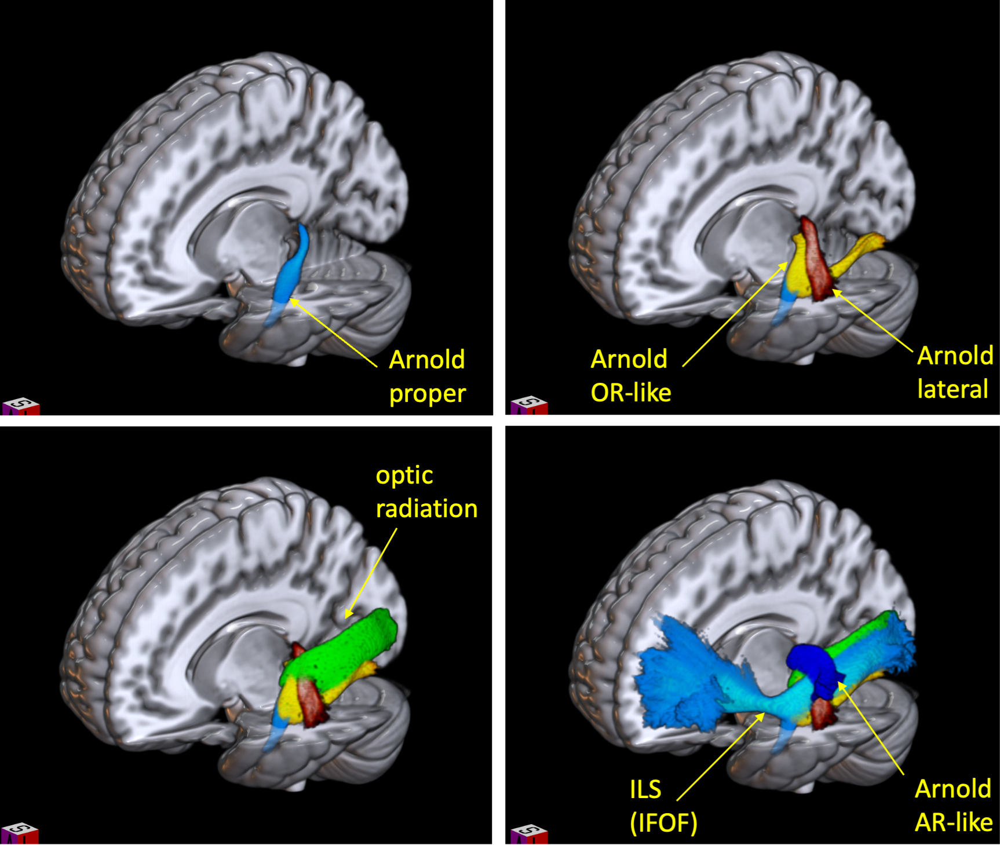

# Atlas Arnold

This repos allows to perfom the virtual dissection to extract left (L) and right (R) Arnold tracts.

1) L_Arnold_proper, R_Arnold_proper
2) L_Arnold_lateral, R_Arnold_lateral
3) L_Arnold_AR_like, R_Arnold_AR_like
4) L_Arnold_OR_like, R_Arnold_OR_like

AR := Accoustic Radiations, OR := Optic Radiations



Figure from the paper

## How to cite
```
Mandonnet et al BRAIN 2024 (under review)
```

## How to install

The script is based on [scilpy](https://github.com/scilus/scilpy)

Make sure your pip is up-to-date before trying to install:
```
pip install --upgrade pip
pip install scilpy==1.6.0
```

If you have any issues to install scilpy please post an issue [here](https://github.com/scilus/scilpy/issues).

## Key points to know

    - The tractogram needs to be in trk format in **MNI space**.
    - The tractogram quality will not be checked. Arnold tracks are "hard-to-track" anatomical pulvino-temporal
      connections. See Mandonnet et al BRAIN 2024 for tractography details. In this work, an aggressive seeding
      TractoFlow pipeline was used in conjunction with a Bundle-Specitifc Tractography (BST) approach. 
    - This script does not perform any registration or warping (see scilpy for documentation on this).

## How to use

```
./dissect_arnold_tracks.sh -i INPUT -r MNI_binary_ROIs -o OUT_DIR

  INPUT=/path/to/[INPUT] INPUT folder containing multiple subjects trk in MNI space

                 [INPUT]
                 ├── S1
                 │   └── *.trk
                 ├── S2
                 │   └── *.trk
                 └── *

  MNI_ROI_PATH=/path/to/atlas_arnold/MNI_ROIs  Path to MNI_binary_ROIs provided in the atlas_arnold_project

  OUT_DIR=/path/to/[OUT_DIR] Output directory
```

## Other tools

- [BST](https://github.com/scilus/bst_flow)
- [scilpy](https://github.com/scilus/scilpy)
- [Tractoflow](https://github.com/scilus/tractoflow)
